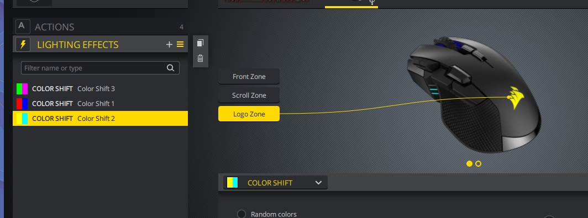
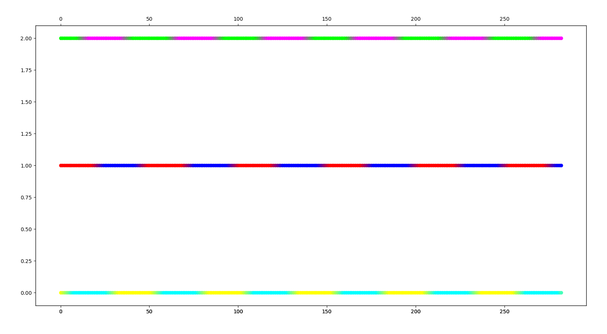

This file describes my findings so far. This document is WPI (I wouldn't bet my life on it), but it's a start on analyzing the protocol to at least get started.

### NOTE: All numbers inside a coding tag (for example `08 01` are in hexadecimal)

## First byte:
- `08` - A data packet from the host to the mouse
- `00` - A data packet from the mouse to the host

## Second Byte:
It seems that the second byte is for choosing which command to send (at least from the host to the mouse). 
- `08 01` - Send setting to
- `08 02` - Read setting???
- `08 05` - ???
- `08 06` - Change something related to Lightning
- `08 08` - ???
- `08 09` - ???
- `08 0d` - ???

## Send Setting To (08 01):
- `08 01 07 00 xx` - Change Angle snapping, where xx is for enable or disable angle snapping (0 or 1)
- `08 01 (21-23 & 1e) 00 xx xx` - Change DPI setting. See the "Changing DPI Settings" section

# Read Setting (08 02):
- `08 02 13` - Read the firmware version, in which the mouse will respond with 
    - `00 02 00 XX YY ZZ`, Where XX, YY, and ZZ are the version number in hex, corresponding to the sub-version. For example, if firmware version is 1.16.107, we expect XX to be 0x01, YY to be 0x10, and ZZ to be 0x6B.

# Deeper info (or info I haven't seperated into individual bytes)
    
## Changing device polling speed
The following command must be sent by the host to change the polling rate:
`08 01 01 00 XX`, where XX is:
- 01 for 125Hz/8ms
- 02 for 250Hz/4ms
- 03 for 500Hz/2ms
- 04 for 1000Hz/1ms
After the command has been sent to the mouse, it will respond with the following packet:
`00 01`. Then, it will reset and reconnecting it in software is required.

## Changing DPI Settings
The 4 packets are sent to the host to change the DPI, which goes as follows:
`08 01 21 00 XX XX`
`08 01 22 00 YY YY`
`08 01 23 00 DD DD`
`08 01 1e 00 PP 00`
Where:
- XX XX: The x-axis DPI for the current profile (in reverse, so 1800(0x0708) would be `08 07`)
- YY YY: The y-axis DPI for the current profile (in reverse)
- DD DD: It seems like this is some default DPI, as it sends the x-axis dpi of the first level (even if it's disabled). 
- PP: The current DPI level (0, 1, or 2)

Also to note, the last 2 packets get sent about 2 seconds after the first 2. I can't seem to find a reason for it

## LED Color

#### Testing Method
While the Icue software is open, I had it preview the colors on the GUI and recorded the packets with Wireshark (and saved the data as `IronclawWireless_While_Icue_Open_Color_Change_All_1.json`). The logo was switching between light-blue and yellow, the scrollwheel was switching between red and blue, and the front of the mouse was switching between green and purple. From then, I am passing the packets thru a Python script that plots each settable color place/area on the mouse on a graph. The colors are stored as a RGB bytes in different locations, so I combine them in Python to recreate the colors. Here are the screenshots for that finding:

#### Conclusion in LED coloring
After analyzing the data, I conclude that each 'LED' packet looks like the following:

`08 06 01 12 00 00 00 LOGO-R SCROLL-R FRONT-R DPI-L-R DPI-M-R DPI-T-R LOGO-G SCROLL-G FRONT-G DPI-L-G DPI-M-G DPI-T-G LOGO-B SCROLL-B FRONT-B DPI-L-B DPI-M-B DPI-T-B`
Where COLOR is the diffrent RGB bytes for each section of the mouse, such as:
- SCROLL-x is the scroll wheel's LEDs
- LOGO-x is the logo's LEDs
- FRONT-x is the front of the mouse's LEDs
- DPI-L-x is the button DPI LED's color
- DPI-M-x is the middle DPI LED's color
- DPI-T-x is the top DPI LED's color

The mouse seems to always respond with the following packet after a color has been set:
`00 06`

Interestingly, the packets don't different if the color is set in "Lightning Effects" and "Hardware Lightning", where the host will still seem to command the mouse during "Hardware Lightning" mode, which in my opinion is a waste of resources.
